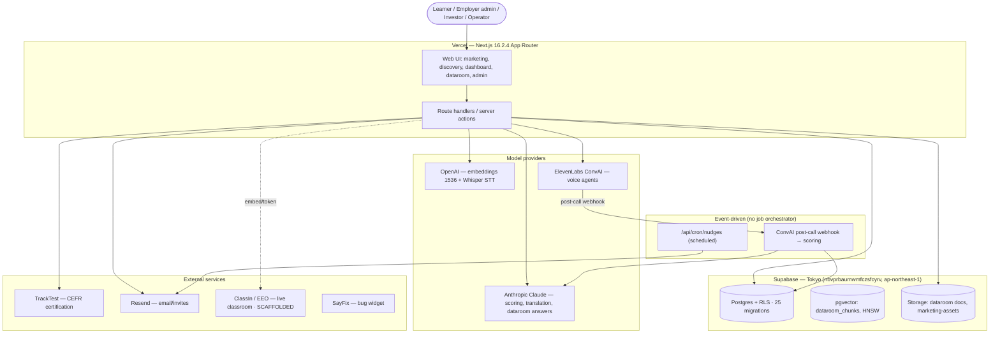

# High-Level Design (HLD) — LingoPure

> **Document type:** Architecture reference (living document)
> **Repo:** `caistech/LingoPureAI` (Vercel slug `lingo-pure-ai`)
> **Status:** `PARTIALLY VERIFIED — 2026-07-10` (verified against deployed code where marked `[V]`; see §11)
> **Owner:** Dennis McMahon (technical lead)
> **Audience:** Minh (ongoing dev), Dennis (review)
> **Companion doc:** `docs/LLD.md` (implementation detail)

---

## How to read this document (verification convention)

This HLD describes **what the system is and how the major pieces fit together**. It is reference, not instruction.

| Marker | Meaning |
|---|---|
| `[A]` ASSERTED | Drafted from brief / memory / inference. **Not** checked against the codebase. |
| `[V]` VERIFIED | Confirmed against deployed code. Cites the file/path/migration. |
| `[?]` GAP | Unknown or contested. Needs investigation before it can be asserted. |

Where this HLD and any brief disagree, **deployed code wins** — the disagreement is flagged, not silently resolved.

> **Context — this is a strategic demo, not the production consumer service.** LingoPure.com is marketing-only today; this repo is the working platform demo (voice discovery → scored learning → certification, plus an investor dataroom and an employer console). Several surfaces are deliberately single-tenant / founder-provisioned. `[A]` (project memory `project_lingopureai_context`).

---

## How to reuse this file as a template (portfolio-wide)

Same convention as the MMC HLD: copy `docs/HLD.md` + `docs/LLD.md`, replace the header + §3 identifiers, reset markers to `[A]`, and re-run the verification pass against *that* repo. Keep section headings identical across repos. Any PR that adds/changes a route, a webhook, a migration, an external integration, or an AI-routing decision **updates the relevant HLD/LLD entry as part of its Definition of Done** — a new claim lands `[A]` and the same PR promotes it to `[V]` with the file it wrote.

---

## 1. System overview & purpose

`[V]` LingoPure is an **AI-first business-English platform for B2B teams in Vietnam / Southeast Asia**. A learner does a **voice discovery session** (a spoken AI conversation), which is **AI-scored against a fixed rubric** into a CEFR-aligned **LP-18 / LP-1000 profile** across six skill dimensions; that profile drives targeted micro-lessons and live classes, with progress re-measured and CEFR certification via TrackTest. *(Verified by the scoring engine `src/lib/scoring/score-discovery.ts` + `rubric.ts`, the `gap_scores`/`gap_score_history` schema in `supabase/migrations/0001,0011,0019`, and the surfaces under `src/app/(app)/`.)*

`[V]` Around that core sit: a **row-backed marketing site + content admin**, an **employer cohort console**, an **investor dataroom** (cited RAG Q&A + reports + voice), a **live-classroom** surface (ClassIn, scaffolded), and a **live interpreter** (LCI Bridge). *(Verified by the route inventory in §3.)*

`[V]` **The proprietary derived layer** (transcripts, LP-scores, profiles, longitudinal history) lives in **LingoPure's own Supabase (Tokyo)** — not on any vendor platform. `[V]` (memory `project_lingopure_deploy_gate`; ClassIn is a scaffolded external source only — §5.2).

---

## 2. Architecture (component view)

> `[V]` **Sync/async boundary.** There is **no background-job orchestrator** (no Inngest/Stripe/HubSpot — confirmed absent from `package.json`). Heavy AI work runs in two places: (1) **the ElevenLabs ConvAI post-call webhook** (`src/app/api/convai/webhook/route.ts`) persists the transcript and triggers discovery scoring; (2) request-path server actions/routes call Claude/OpenAI inline (short calls). A **nudges cron** (`src/app/api/cron/nudges/route.ts`) fires reminder emails.

---

## 3. Modules (bounded contexts)

`[V]` Route inventory confirmed under `src/app/`:

| Module | Route(s) | Responsibility | Primary async / AI |
|---|---|---|---|
| **Marketing + content admin** | `(marketing)/` (`/`, `/for-companies`, `/for-individuals`, `/method`, `/book-a-demo`, `/company`, `/preview`); `/admin/*` | Public sales-flow site (canvas-reviewable) + row-backed content editing | — (see LLD §2) |
| **Voice discovery + scoring** | `(app)/onboarding/*` (`/`, `/session`, `/battery`); `api/convai/*` | Spoken AI assessment → LP-18/LP-1000 profile | ConvAI + Claude scoring |
| **Learner app** | `(app)/dashboard`, `/lessons`, `/lessons/[id]`, `/settings` | Gap radar, micro-lessons, plan, certifications | Claude (lesson eval) |
| **Live classroom** | `/classroom/[sessionId]` (+ `/transcribe`), `/exam/[id]` | Live class (ClassIn embed — scaffolded) + transcript/exam | Whisper (planned) |
| **Employer console** | `/employer/*` (login + `(authed)` overview/departments/roles/staff/students/teachers) | Cohort admin over a company's learners | — |
| **Investor dataroom** | `/investor` + `/investor/(authed)/*`; **admin** `/investor/admin/(console)/*` | Cited RAG Q&A, documents, reports, NDA-gated deep-dive, voice (Morgan) | OpenAI embeddings + Claude answers |
| **LCI Bridge** | `/lci-bridge`; `api/interpret` | Single-device turn-based live interpreter | Claude / STT |
| **i18n** | (cross-cutting) | 11-language UI dictionary + render-time translation | Claude Haiku |
| **Static/legal** | `/about`, `/contact`, `/pricing`, `/privacy`, `/terms`, `/languages`, `/demo` | Marketing/legal + the original product landing (`/demo`) | — |

`[V]` Auth roles differ by context (§8): **learners** (`students`), **employer admins** (`employer_admins`: owner/hr/viewer), **investor operators** (`ADMIN_EMAILS` allowlist), **content editors** (`content_editors`: admin/marketing/readonly). There is no single global role enum.

---

## 4. Tech stack

`[V]` Pins from root `package.json` (npm; `"private": true`):

| Layer | Technology | Pin / detail |
|---|---|---|
| Frontend | Next.js App Router, React, TypeScript | `next 16.2.4`, `react`/`react-dom 19.2.4`, `typescript ^5` |
| Server | Next.js route handlers / server actions | **Single Next.js app — no separate service, no Inngest/queue.** |
| Styling | Tailwind CSS v4 | `tailwindcss ^4` (`@theme` tokens in `globals.css`; scoped `.mkt` marketing tokens in `(marketing)/marketing.css`) |
| Database | Supabase Postgres (**Tokyo `ap-northeast-1`**) | `@supabase/supabase-js ^2.105.1`, `@supabase/ssr ^0.10.2`. Project `nbvprbaumwmfczsfcyrv`. **25 migrations** (`0001`–`0025`) |
| Vector / RAG | pgvector | `dataroom_chunks.embedding vector(1536)`, **HNSW** (`vector_cosine_ops`), RPC `match_dataroom_chunks` (`0020_investor_dataroom.sql:27,57,61,133`) |
| Object storage | Supabase Storage | dataroom document buckets; `marketing-assets` (public, created on demand by the upload route) |
| LLM (generation) | Anthropic Claude | `@anthropic-ai/sdk ^0.91.1`; **`claude-sonnet-4-6`** for discovery scoring (`score-discovery.ts:45`), **`claude-haiku-4-5-20251001`** for i18n translation (`i18n/translate.ts:32`) |
| LLM (embeddings + STT) | OpenAI | `openai ^6.35.0`; **`text-embedding-3-large`@1536** for dataroom RAG (`0020:46`, `lib/investor/retrieval.ts`); **Whisper** STT (`lib/transcription/whisper.ts`) |
| Voice (conversational) | ElevenLabs ConvAI | `@caistech/elevenlabs-convai ^0.4.0` + `@elevenlabs/client ^1.4.0` + `@elevenlabs/react ^1.3.0`. Discovery coach ("Aria"), investor voice ("Morgan") |
| Auth surface | `@caistech/corporate-components ^0.3.0` | shared auth components |
| Doc ingestion | `mammoth` (docx), `pdf-parse`/`pdf-lib` (PDF), `xlsx` | dataroom document extraction |
| Email | Resend | invites + nudges (`lib/email/invite.ts`, direct REST) |
| Certification | TrackTest | CEFR exams (`lib/tracktest/*`) `[A]` — files present, not deep-read this pass |
| Bug reporting | SayFix | `@caistech/sayfix-embed ^0.4.0` (suppressed on marketing routes) |
| Validation | Zod | `zod ^4.4.1` |
| Testing | Playwright | `@playwright/test ^1.59.1` (`tests/e2e/`) |
| Hosting | Vercel | slug `lingo-pure-ai`; `NEXT_PUBLIC_CANVAS_MODE` gates the marketing review canvas |

> `[V]` **AI routing.** Unlike MMC there is **no central routing table**; each call site picks its model directly: Claude Sonnet 4.6 for the prescriptive discovery rubric (strict Zod schema, `messages.parse`); Claude Haiku for batched UI-string translation; OpenAI `text-embedding-3-large`@1536 for dataroom chunk embeddings + Whisper for audio transcription; Claude for investor-dataroom answer synthesis. `[A]` No cross-provider fallback chain observed.

---

## 5. Key data flows

### 5.1 Voice discovery → LP-18/LP-1000 scoring `[V]` (the core loop — LLD §1)
1. Learner starts a spoken discovery session over **ElevenLabs ConvAI** (`onboarding/discovery-session.tsx`, token via `api/convai/token`).
2. On call end, the **post-call webhook** (`api/convai/webhook`) upserts `discovery_sessions` with `convai_conversation_id` + full `transcript_json` (per-turn `time_in_call_secs`) + `completed_at`.
3. `score-discovery.ts` sends the transcript to **Claude Sonnet 4.6** against `rubric.ts` (strict Zod schema) → **6 `gap_scores` rows** (`source='discovery'`, 0–1000 scale) + `profile_json`; also re-scorable idempotently via `POST /api/scoring/discovery`.
4. A structured **task battery** (`onboarding/battery`, mig `0016/0017`) refines canonical skill rows; `gap_score_history` (mig `0019`) logs the longitudinal series.

### 5.2 Live classroom (ClassIn) `[V] — SCAFFOLDED, not live`
`classroom/[sessionId]` builds a ClassIn SSO embed via `lib/classin/{token,embed}.ts`, but the analytics/recording adapter (`lib/classin/api.ts`) **throws `ClassinUnavailableError`** pending EEO credentials, and the session page shows a **sandbox notice** when `CLASSIN_APP_ID` is unset. Scheduling inserts a demo `classin_sessions` row. **No ClassIn data enters the scoring path yet.** *(See `docs/AUDIT_REPORT.md` §A5.)*

### 5.3 Investor dataroom (cited RAG) `[V]`
Documents are ingested (`mammoth`/`pdf-parse`) → chunked + embedded (OpenAI `text-embedding-3-large`@1536) into `dataroom_chunks`; investor questions run `match_dataroom_chunks` (cosine, HNSW) → Claude synthesises a **cited** answer (`lib/investor/{retrieval,answer,build-report}.ts`). NDA-gated deep-dive (mig `0021`); access logged (`dataroom_audit`, mig `0020`); voice via "Morgan" (`investor_voice_sessions`, mig `0022`).

### 5.4 Content editing (rows, not files) `[V]` (LLD §2)
`marketing_content` (draft/published) + `marketing_testimonials`/`marketing_logos` are overlaid onto the static `src/content/home.ts` by `getHomeContent()`; the public page reads published, `/preview` reads drafts, `/admin/*` edits with RLS + an append-only audit trigger.

---

## 6. External integrations

| Service | Purpose | Direction | Notes / verify |
|---|---|---|---|
| ElevenLabs ConvAI `[V]` | Conversational voice (discovery coach, investor Morgan) | Out + webhook | `@caistech/elevenlabs-convai ^0.4.0`; HMAC-verified webhook |
| Anthropic `[V]` | Scoring, translation, dataroom answers | Outbound | `@anthropic-ai/sdk ^0.91.1` |
| OpenAI `[V]` | Embeddings (1536) + Whisper STT | Outbound | `openai ^6.35.0` |
| Supabase `[V]` | Postgres + Auth + Storage (Tokyo) | Out | `nbvprbaumwmfczsfcyrv` |
| Resend `[V]` | Invites + nudge emails | Outbound | `lib/email/invite.ts` |
| TrackTest `[A]` | CEFR certification | Outbound | `lib/tracktest/*` (present; not deep-read) |
| ClassIn / EEO `[V]` | Live classroom | Out (planned) | **Scaffolded — not live** (§5.2) |
| SayFix `[V]` | Bug reporting widget | Out | suppressed on marketing/investor/lci routes |

---

## 7. Deployment & environments

`[V]` Vercel (slug `lingo-pure-ai`, prod `lingo-pure-ai.vercel.app`); Supabase **Tokyo `ap-northeast-1`** (`nbvprbaumwmfczsfcyrv`) for data/auth/storage; **AU/JP residency posture** — derived learner data resides in Japan, not the PRC (contrast the scaffolded ClassIn source). `NEXT_PUBLIC_CANVAS_MODE=true` on the deployed marketing canvas.
`[V]` Migrations are **CLI-driven** (`supabase db push --linked`); the shell `SUPABASE_ACCESS_TOKEN` holds a Vercel token — use the `sbp_` token at `~/.supabase-token` (memory `project_lingopure_deploy_gate`).
`[?]` Environment list (prod/preview/local) and prod-access ownership are operational facts not determinable from the repo.

---

## 8. Cross-cutting concerns

- **Auth & RBAC** `[V]` — Supabase Auth (`@supabase/ssr`); `getUser()` gate on every data route. **Four separate role contexts** (no single enum): `students` (learners), `employer_admins` (owner/hr/viewer, mig `0012`), investor operators (`ADMIN_EMAILS` allowlist, `lib/investor/operator-auth.ts`), `content_editors` (admin/marketing/readonly, mig `0023`, resolved by `current_content_role()`).
- **Row-Level Security** `[V]` — RLS enabled across the schema; learner/telemetry tables scoped to `student_id = auth.uid()`; content/investor tables scoped to their role functions. The content-admin boundary ("touch content, not the instrument") is an RLS boundary — content editors have policies only on content tables. `[?]` exact table/policy counts not tallied this pass.
- **Storage** `[V]` — Supabase Storage for dataroom documents and the public `marketing-assets` bucket (2 MB image cap; created on demand by `api/admin/assets/upload`).
- **i18n** `[V]` — 11-language UI dictionary (`lib/i18n/dictionary.ts`), cookie/profile-driven active language; render-time Claude-Haiku translation for dynamic student-facing content (`lib/i18n/translate.ts`); marketing site is EN-only today (VI stored via the content admin for later).
- **Voice memory / security** `[V]` — ConvAI webhook verifies HMAC; identity is server-derived at connect (`conversation_id`), per the portfolio Voice Memory Standard.
- **Observability** `[?]` — no Sentry/analytics dependency in `package.json`; logging is `console`-level. (A gap vs. the MMC build, which wired Sentry + Vercel Analytics.)
- **Security / residency** `[V]` — Tokyo data residency; auth gate before data access; secrets via env (service-role never client-side); SayFix + ConvAI webhooks verify signatures.

---

## 9. Open items linked to this design

- `[V]` **ClassIn integration is scaffolded, not live** — needs EEO SDK credentials + confirmation of the embed shape, analytics granularity, and per-speaker recording (`docs/AUDIT_REPORT.md` §A5; `docs/CLASSIN_INTEGRATION_SPEC.md` is the intended next artifact).
- `[V]` **Score-row provenance gap** — `gap_scores`/`gap_score_history` carry `source` but **no `model_id`/`rubric_version`/`prompt_hash`/`extraction_method`** (`AUDIT_REPORT.md` §A6).
- `[V]` **Audio retention** — discovery keeps the transcript only; **no audio persisted** (§A7).
- `[?]` Observability (Sentry/analytics) unwired; billing/multi-tenant (lane-1) not built (demo scope).
- `[A]` Content admin: live editor round-trip not yet exercised headlessly; next/image optimisation for uploaded assets deferred.

---

## 10. Verification checklist (status after the 2026-07-10 pass)

- [x] `[V]` Stack = Next.js 16.2.4 + Supabase (Tokyo) + ElevenLabs + Anthropic/OpenAI; **no Inngest/Stripe/queue** (package.json).
- [x] `[V]` Modules mapped to routes (§3); four separate auth-role contexts.
- [x] `[V]` Core loop: ConvAI discovery → webhook → Claude Sonnet 4.6 rubric → 6 `gap_scores` (0–1000) + `gap_score_history`.
- [x] `[V]` Investor RAG: pgvector 1536 + HNSW + `match_dataroom_chunks`; OpenAI embeddings; Claude cited answers.
- [x] `[V]` ClassIn scaffolded (throws `ClassinUnavailableError`); no audio retained; scores lack provenance columns.
- [x] `[V]` Content admin: rows overlay `home.ts`; draft/preview/publish; RLS + append-only audit.
- [ ] `[?]` RLS table/policy counts; observability; environments/prod-access ownership — not code-tallied this pass.

---

## 11. Corrections summary (evidence the pass read the code)

**Confirmed (`[A]` → `[V]`):** stack pins; the discovery→scoring loop and its models; the six-skill 0–1000 rubric; investor pgvector RAG (1536/HNSW/`match_dataroom_chunks`) with OpenAI embeddings; four separate role contexts; Tokyo residency; the content-admin rows/overlay/RLS/audit; ClassIn scaffolded-not-live; no job orchestrator.

**Differs from the MMC template (by design, not error):** no Inngest (async = ConvAI webhook + nudges cron); no Stripe/billing (demo scope); no central AI routing table (per-call-site models); no Sentry/analytics yet.

**Still `[?]`:** RLS table/policy counts; observability wiring; environment list + prod-access ownership; TrackTest integration depth (files present, not deep-read this pass).
